# Data Analysis Using Excel
***
This is a training project demonstrating the analysis of data using Excel, to identify trends, solve problems, and provide meaningful insights to business stakeholders for better decisoin making.

## **Introduction:**
___
This is an Excel project. I am currently undergoing a data analytics training and for my first week of training, I was given two assignments. The first assignment required that I create an employee data set and answer some specific questions, practicing the use of conditional foormatting. For the second assignment, a company's sales dataset was provided. Having been taught conditional formatting, data manipulation, managaement, functions, and formulas in Excel, it is exciting to use the skills learned to analyse the dataset and provide useful insights.
-*Disclaimaer:*_ The datasets used for this project are solely made up for the purpose of training.

## **Skills/Concepts demonstrated:**
***

  **Excel functions and formulars Applied:**
  - conditional formatting
  - text to column
  - sort and filter
  - find and select
  - data type formatting
  - functions e.g [LEFT(), RIGHT(), MID(), SUM(), AVERAGE(), CONCATNATE(), COUNT(), IF(), MIN(), MAX()]

## **Problem Statement/Questions to be answered:**
___
### _*Assignment 1:*_

*Step 1:*
I created an employee dataset containing 20 rows of unique employee id, full names, department, salary, and job type. Then, I formatted the data by aligning the texts, changing the data type, and highlighting the headers.

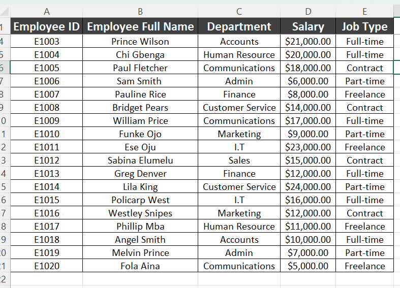

*Step 2:*
The following tasks were requested:

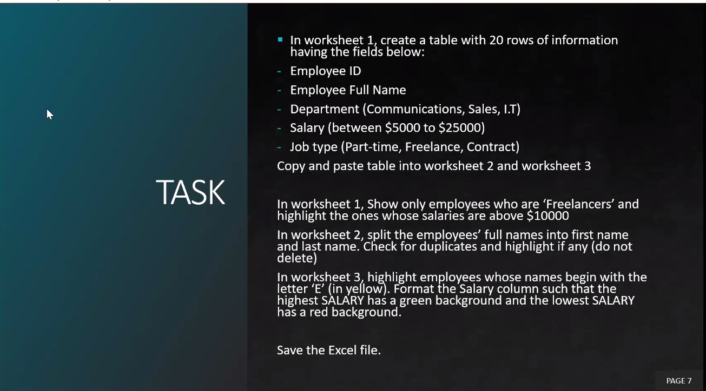

- For question 1, I copied the data to a new worksheet and labelled it. Next, using the filters function, I seleceted employees who are freelancers under the "job type" column. Next, I used conditional formatting to highlight in green, freelancers whose slaries were above $10,000.

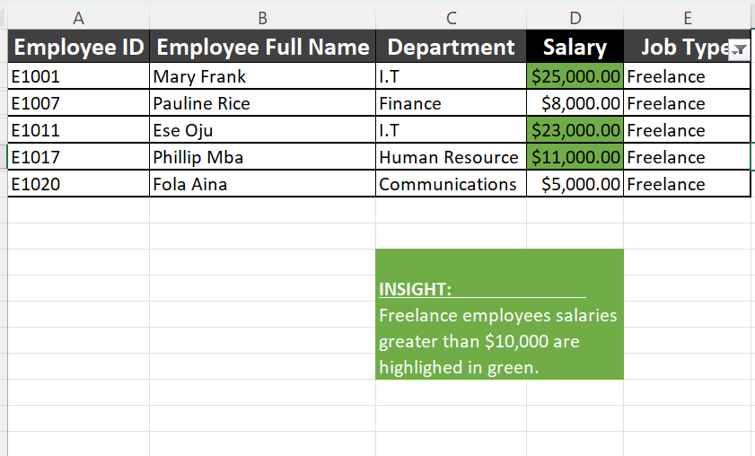

- For question 2, I copied the data to a new worsheet and split the employees fullnames using two diffetent functions. First, I inserted 2 columns to the right of column B and using the "tesxt-to-column" function, I split the names into 2 different columns, specifying the delimeter. Secondly, I used the LEN and MID functions to split the fullnames into columns H and I just to showcase a range of how the same results can be accomplished. As an additional perk, I used the CONCATNATE function to join the first and last names back together into column J.

LEFT() Functiion              |  MID() Function               |  CONCATNATE() Function
:--------------------------:  |  :--------------------------:  |  :--------------------------:
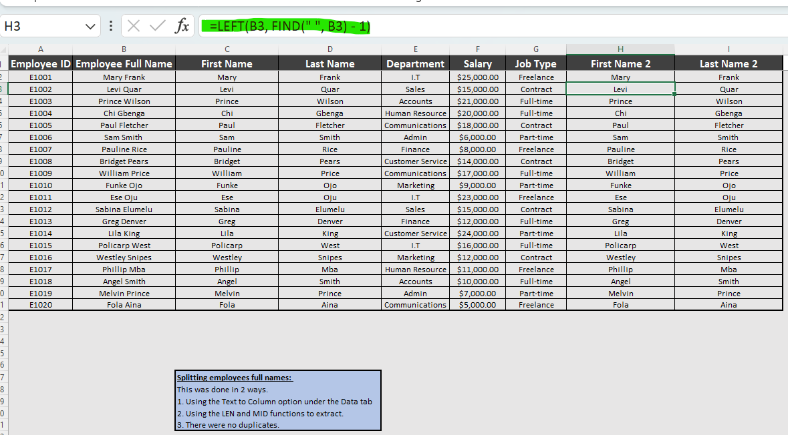  | 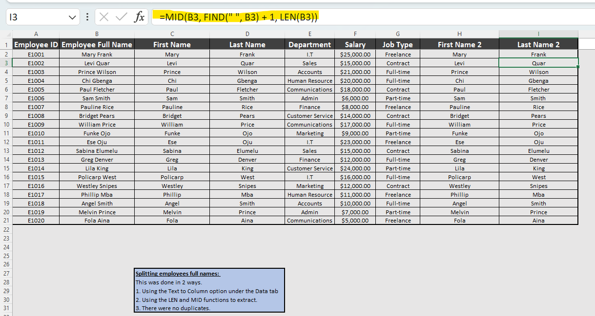  |  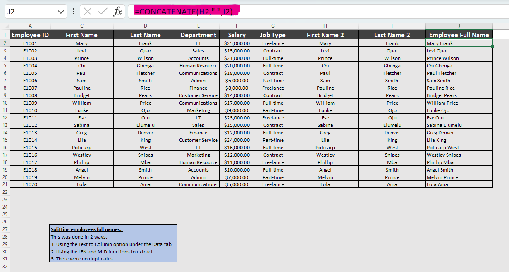

- For question 3, I copied the data again to a new worksheet and used conditional formatting to highlight in yellow, employees name beginning with an 'E'. Next, I used conditional formatting to highlight the highest salary in green and the lowest in red.

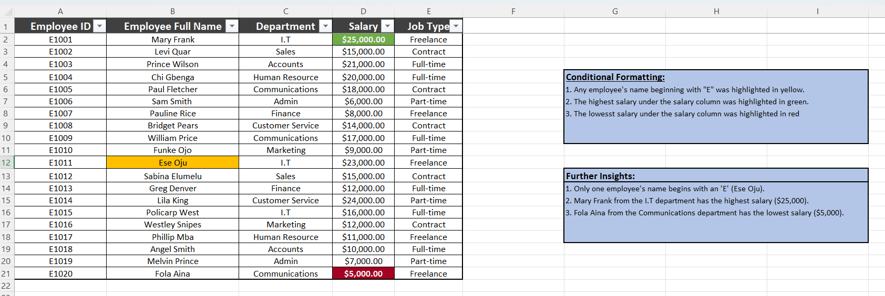

### _*Assignment 2:*_

The business had questions about their sales that they needed answers to. They wanted to know the following:

- What was the total revenue?
- How much profit was generated?
- What was the average revenue?
- On average, how many units of products were sold?
- How much discount was given in total?
- How many transactions were recorded?
- What was the highest profit generated in a single transaction?
- Display high and low sales values

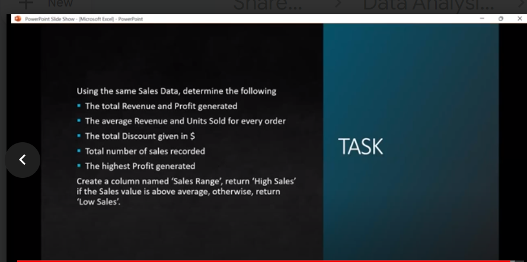

*Step 1:*
I cleaned the data that was provided by aligning texts, checking for duplicates, applying filters, changing the data types for each columns, formatting the headers, and creating mini-functions to check if the values computed in some calculated columns were correct.

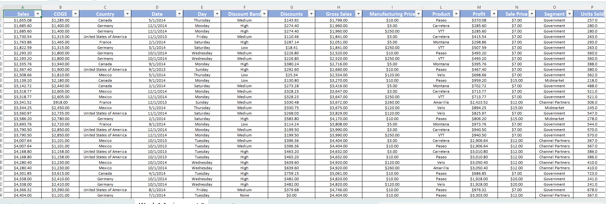

*Step 2:*
I created new columns and used the IF() function to display high/low profit bands in column R, and high/low sales in column U. Next using conditional formatting, I highlighted low profits and sales in red, and high profits and sales in green. Also, using directional bars, I highlighted when profits are below/above average.

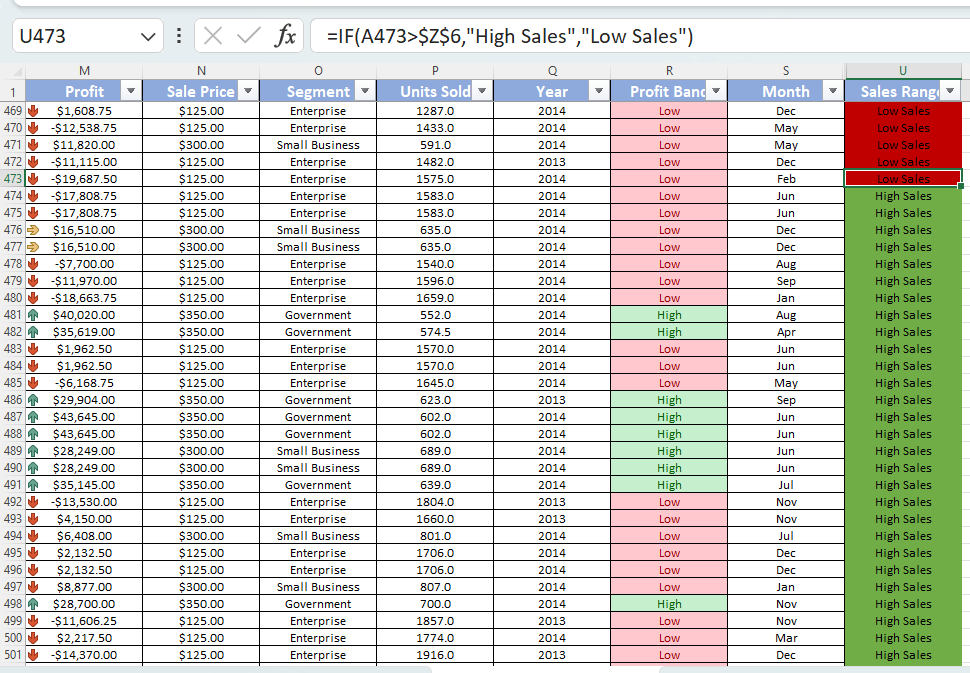

*Step 3:*
I used the SUM() formular to calculate the total revenue, profit, and discount. I also used the AVEREAGE() function to calculate the average revenue, unit sold, and profit. Using the COUNT() function, I computed the number of transactions/sales recorded. The MAX() and MIN() functions were used to calculate the highest and lowest profits generated respectively. I used colour formatting to highlight the various values using different colours.

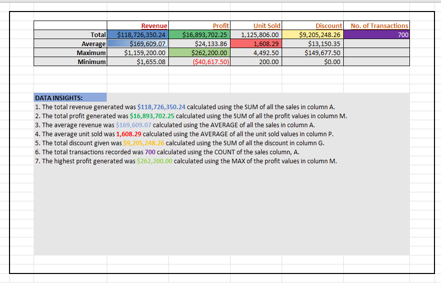

*Step 4:*
In addtion to the above, I created 2 new sheets and used filter formatting to select rows with high profit bands but low sales, and rows with low profit bands but high sales. The intent was to capture whether or not the profit generated was directly proportional to the sales amount.

Low Sales with high profit    |    High sales with low profit
:---------------------------: | :------------------------------:
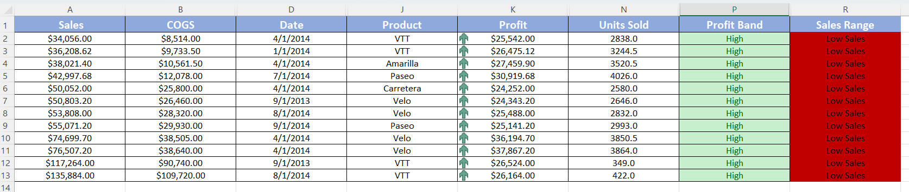 | 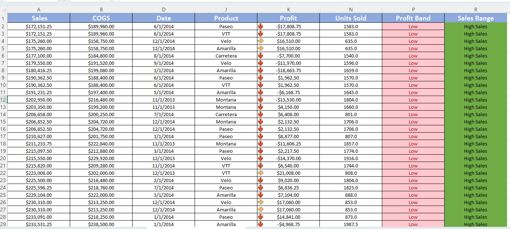

## **Data Sourcing:**
 ___
 The first dataset was generated by be for the purpose of the assignment. The second data used was provided by the class instructor. The dataset contained the following information:

  - Data on net sales, gross sales, discounts, profits, products, transaction dates, country, units sold, manufaturing price, selling prices cost of goods sold, etc.
  - Overall, there are 702 (including the headers) and 17 columns.
  - One sheet with all of the data computed
  - Three new sheets were added to utress points for the assignment

## **Conclusion and Recommendations:**
***
- Overall, the company generated a total revenue of $118,726,350.24
- It was a profitable period for the company as they made a total proit of $16,893,702.25
- From the data, there was a total of 63 transactions with a negative profit value and zero profit. This "loss" amounted to a total of &777,321.25 which  greatly impacted the overall profit for the period.
- Of the 63 losses, 10 came from Canada, 13 from France, 12 from Germany, 14 from Mexico, and 14 from the United States. Although Canada had the least nmber, the number of transactional losses across all regions appear to be within close range.
- More investigations can be carried out to determine how to curb losses, and boost overral sales revenue and profits across all contries.

  1{
