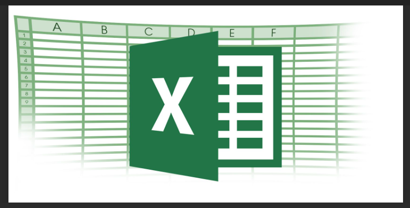

# Data_analysis_using_Excel
This project is about analysing data using Excel to identify trends and provide meaningful insights to business stakeholders for better decisoin making.

**Introduction:**
-----------------------------------------------------------------------------------------------------------------------------------------------------------------------
I am currently undergoing a data analytics training and a company's sales dataset was given to us in class to work on as our first assignment. Having been taught data manipulation, managaement, functions, and formulas in Excel, it is exciting to use the skills learned to analyse the dataset and provide useful insights.

  **Excel functions and formulars Applied:**
  - conditional formatting
  - text to column
  - sort and filter
  - find and select
  - data type formatting
  - functions e.g [LEFT(), RIGHT(), SUM(), AVERAGE(), COUNT(), IF(), MIN(), MAX()]

**Problem Statement/Questions to be answered:**
-----------------------------------------------------------------------------------------------------------------------------------------------------------------------
The business had questions about their sales that they needed answers to. They wanted to know the following:

- What was the total revenue?
- How much profit was generated?
- What was the average revenue?
- On average, how many units of products were sold?
- How much discount was given in total?
- How many transactions were recorded?
- What was the highest profit generated in a single transaction?
- Display high and low sales values

  **Data Sourcing:**
  ---------------------------------------------------------------------------------------------------------------------------------------------------------------------
  The data used was provided my the class instructor. The dataset contained the following information:

  - Data on net sales, gross sales, discounts, profits, products, transaction dates, country, units sold, manufaturing price, selling prices cost of goods sold, etc.
  - Overall, there are 702 (including the headers) and 17 columns.
  - One sheet with all of the data computed

    **Data Transformation and Cleaning:**
-----------------------------------------------------------------------------------------------------------------------------------------------------------------------

Problem Statement:

Skill
